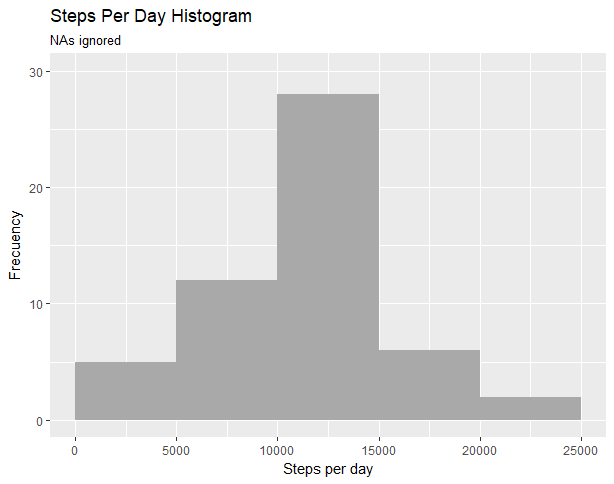
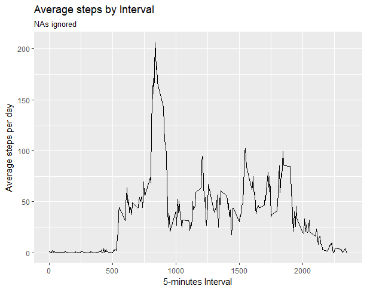
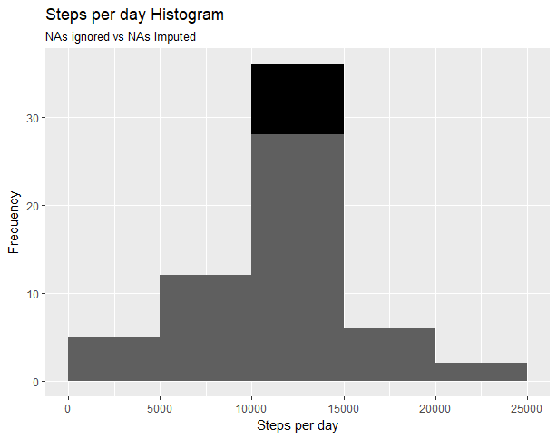

```{r setup, include=FALSE}
knitr::opts_chunk$set(echo = TRUE)
```

## Intro
This document is the report for the Reproducible Research Course Project 1. The purpose is to answer some specific questions regarding data collected from a personal activity monitoring device. Two months of data were collected at 5 minutes intervals. The data is avaliable at the course web site:

[Activity monitoring data](https://d396qusza40orc.cloudfront.net/repdata%2Fdata%2Factivity.zip)

The dataset is a comma-separated-value (CSV) file containing 17,568 observations and three variables:

- **steps**: Number of steps at a given 5 minute interval
- **date**: Date of the measurement (YYYY-MM-DD)
- **interval**: Identifier for the interval, range from 0 to 2355

## Loading and Preprocesing the data

#### 1. Load required libraries
```{r}
library(dplyr)
library(lubridate)
library(ggplot2)
```

#### 2. Load the data
```{r}
#my_url <- "https://d396qusza40orc.cloudfront.net/repdata%2Fdata%2Factivity.zip"
#download.file(my_url, destfile="activity.zip")
#unzip("activity.zip")
my_df <- read.csv("activity.csv")
```

## What is mean total number of steps taken per day?
For this part of the project, missing values (NAs) were ignored.

#### 1. Calculate the total number of steps taken per day

```{r}
df.original <- my_df %>%
  select(steps, date) %>%
  group_by(date) %>%
  summarize(steps=sum(steps)) %>%
  filter(!is.na(steps))
```

#### 2. Make a histogram of the total number of steps taken each day

```{r}
plot1 <- ggplot(df.original, aes(steps)) +
	geom_histogram(breaks=seq(0, 25000, by=5000), fill="grey") + 
	labs(title="Steps Per Day Histogram") +
	labs(subtitle="NAs ignored") +
	labs(x="Steps per day", y="Frecuency") +
	ylim(c(0,30))
```



#### 3. Calculate and report the mean and median of the total number of steps taken per day

```{r}
df.original.summ <- summary(df.original$steps)
df.original.summ
```

The average number of steps per day is `r format(df.original.summ[[4]], digits=5)`; and the Median is `r format(df.original.summ[[3]], digits=5)` steps per day.

## What is the average daily activity pattern?

#### 1. Make a time series plot of the 5-minute interval (x-axis) and the average number of steps taken, averaged across all days (y-axis)

```{r}
df.sbi <- my_df %>%
  select(steps, interval) %>%
  filter(!is.na(steps)) %>%
  group_by(interval) %>%
  summarize(avg.steps=mean(steps))

plot2 <- ggplot(df.sbi, aes(interval, avg.steps)) +
	geom_line() + 
	labs(title="Average steps by Interval") +
	labs(subtitle="NAs ignored") +
	labs(x="5-minutes Interval", y="Average steps per day")
```



#### 2. Which 5-minute interval, on average across all the days in the dataset, contains the maximum number of steps?

```{r}
sbi.max <- df.sbi %>%
  select(interval, avg.steps) %>%
  filter(avg.steps==max(avg.steps))
sbi.max
```

The maximum number of steps is `r format(sbi.max$avg.steps, digits=3)`, at interval `r format(sbi.max$interval, digits=3)`, which correspond to 8:35 in the morning.

## Imputing missing values

#### 1. Calculate and report the total number of missing values in the dataset (i.e. the total number of rows with NAs)


```{r}
df.na <- nrow(my_df[is.na(my_df$steps),])
df.na
```

There are `r format(df.na, digits=4)` NAs in the dataset.

#### 2. Devise a strategy for filling in all of the missing values in the dataset. The strategy does not need to be sophisticated. For example, you could use the mean/median for that day, or the mean for that 5-minute interval, etc.

The strategy was to use the Median divided by the number of intervals per day (288).

#### 3. Create a new dataset that is equal to the original dataset but with the missing data filled in.

```{r}
df.imputednas <- my_df %>%
mutate(steps=replace(steps, is.na(steps), df.original.summ[[3]]/288))
head(df.imputednas)
```

#### 4. Make a histogram of the total number of steps taken each day and Calculate and report the mean and median total number of steps taken per day. Do these values differ from the estimates from the first part of the assignment? What is the impact of imputing missing data on the estimates of the total daily number of steps?

```{r}
df.imputed <- df.imputednas %>%
  select(steps, date) %>%
  group_by(date) %>%
  summarize(steps=sum(steps))

plot3 <- ggplot() + 
	geom_histogram(aes(x=df.imputed$steps), breaks=seq(0, 25000, by=5000), fill="black") +
	geom_histogram(alpha = 0.5, aes(x=df.original$steps), breaks=seq(0, 25000, by=5000), fill="grey") +
	labs(title="Steps per day Histogram") +
	labs(subtitle="NAs ignored vs NAs Imputed") +
	labs(x="Steps per day", y="Frecuency")
```



```{r}
df.imputed.summ <- summary(df.imputed$steps)
df.imputed.summ
```

After imputing missing values, the average number of steps per day is `r format(df.imputed.summ[[4]], digits=5)`; and the Median is `r format(df.imputed.summ[[3]], digits=5)` steps per day. While there is no change in these values, We can see that the frecuency in the range between 10000 and 15000 steps increased from 28 to 36.

## Are there differences in activity patterns between weekdays and weekends?

#### 1. Create a new factor variable in the dataset with two levels - "weekday" and "weekend" indicating whether a given date is a weekday or weekend day.

```{r}
sbi.wd <- df.imputednas %>%
     select(steps, interval, date) %>%
     mutate(weekday=ifelse(wday(date) %in% c(6,7), 'weekend', 'weekday')) %>%
     group_by(interval, weekday) %>%
     summarize(avg.steps=mean(steps))
```

#### 2. Make a panel plot containing a time series plot of the 5-minute interval (x-axis) and the average number of steps taken, averaged across all weekday days or weekend days (y-axis).

```{r}
plot4 <- ggplot(sbi.wd, aes(interval, avg.steps)) +
	geom_line() +
	facet_grid(weekday ~ .) +
	labs(title="Average steps by Interval") +
	labs(subtitle="Weekday vs Weekend") +
	labs(x="5-minutes Interval", y="Average steps per day")
```


We can see that there are differences in activity patterns depending on the type of day, with some increase in the averge number of steps during the weekends.
